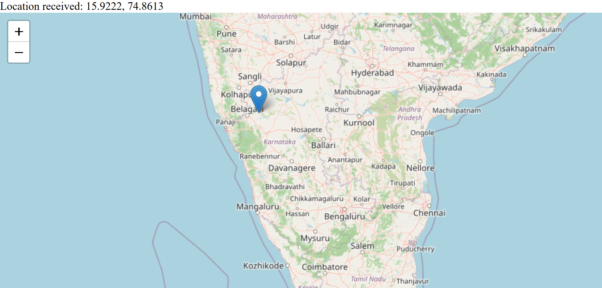

# 📍 Real-Time Location Tracker

A real-time location tracking web application built using **Node.js**, **Express.js**, **Socket.IO**, and **Leaflet.js**. The application tracks the live location of connected devices and displays them on an interactive map.

## 🚀 Features

* 📡 Live location tracking using the Geolocation API
* 🗺️ Interactive map powered by Leaflet.js
* 🔄 Real-time location updates with Socket.IO
* 📍 Automatically updates the user's position on the map
* 👥 Supports tracking multiple connected users

## 🛠️ Tech Stack

* **Frontend**

  * HTML
  * CSS
  * JavaScript
  * Leaflet.js

* **Backend**

  * Node.js
  * Express.js
  * Socket.IO

## 📂 Project Structure

```text
Tracker/
│── public/
│   ├── css/
│   ├── js/
│
│── views/
│
│── app.js
│── package.json
│── package-lock.json
│── .gitignore
│── README.md
```

## ⚙️ Installation

1. Clone the repository.

```bash
git clone https://github.com/your-username/your-repository.git
```

2. Navigate to the project folder.

```bash
cd your-repository
```

3. Install dependencies.

```bash
npm install
```

4. Start the server.

```bash
node app.js
```

or

```bash
npm start
```

5. Open your browser and visit:

```text
http://localhost:3000
```

## 📱 Testing on Mobile

To test the application on a mobile device:

1. Connect your phone and computer to the same Wi-Fi network.
2. Find your computer's IPv4 address using:

```bash
ipconfig
```

3. Open the application on your phone:

```text
http://YOUR_IP_ADDRESS:3000
```

Example:

```text
http://192.168.1.10:3000
```

4. Allow location permission when prompted.

## 📌 Dependencies

* Express
* Socket.IO
* EJS
* Leaflet.js

Install them using:

```bash
npm install express socket.io ejs
```

## 📸 Screenshots



## 🌱 Future Improvements

* User authentication
* Custom user markers
* Live route tracking
* Marker clustering
* Location history
* Mobile-friendly UI
* Deployment to a cloud hosting platform

## 🤝 Contributing

Contributions are welcome. Feel free to fork the repository, create a feature branch, and submit a pull request.

## 📄 License

This project is licensed under the MIT License.

## 👩‍💻 Author

**Vanishree Ganagi**

If you found this project helpful, consider giving it a ⭐ on GitHub.
